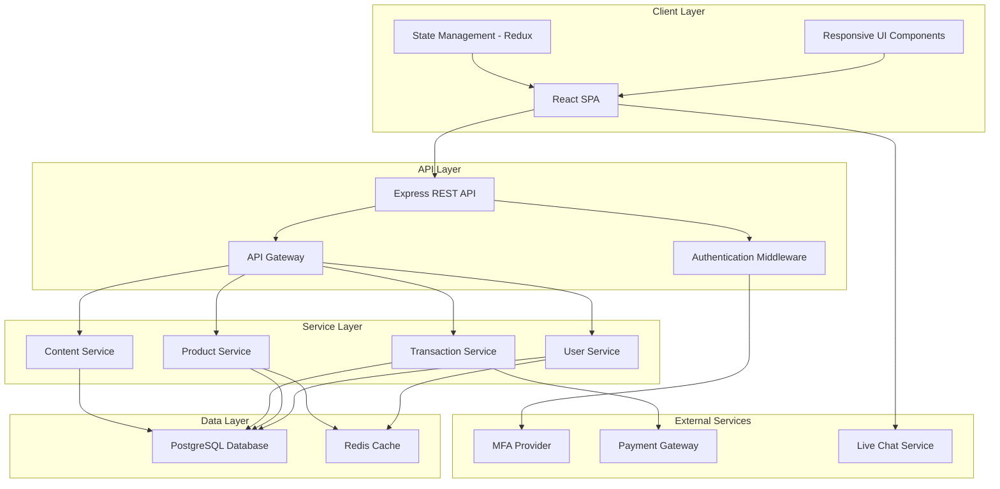

# Design Document

## Overview

The RegTech Banking Website is a modern, secure web application that serves as the primary digital presence for a banking institution. The design emphasizes trust, innovation, and compliance through a sophisticated visual language inspired by regulatory technology aesthetics. The application will be built using a component-based architecture with React for the frontend, Node.js/Express for the backend API, and integration with third-party services for authentication and payment processing.

## Architecture

### High-Level Architecture


```

### Technology Stack

**Frontend:**
- React 18+ with TypeScript
- Redux Toolkit for state management
- React Router for navigation
- Styled Components for CSS-in-JS styling
- Framer Motion for animations
- Axios for API communication

**Backend:**
- Node.js with Express
- TypeScript
- JWT for authentication tokens
- Helmet for security headers
- Rate limiting middleware

**Database:**
- PostgreSQL for relational data
- Redis for session management and caching

**External Integrations:**
- Auth0 or similar for MFA
- Stripe or similar for payment processing
- Intercom or similar for live chat

**DevOps:**
- Docker for containerization
- Nginx as reverse proxy
- SSL/TLS certificates
- CDN for static assets

## Components and Interfaces

### Frontend Components

#### Layout Components

**Header Component**
- Navigation menu with links to all main pages
- Login/Account button
- Responsive hamburger menu for mobile
- Sticky positioning on scroll

**Footer Component**
- Quick links to important pages
- Social media links
- Legal information and disclaimers
- Contact information

**Hero Section Component**
- Full-width background with RegTech-inspired imagery
- Animated tagline with fade-in effect
- Glass-panel overlay effect
- Quick action buttons

#### Page Components

**Homepage Component**
- Hero section with tagline
- Feature highlights grid (3-column layout)
- Product showcase carousel
- Trust indicators (security badges, certifications)
- CTA sections

**About Us Component**
- Mission statement section with glass-panel background
- Interactive timeline component showing milestones
- Team/corporate imagery with blur effects
- Values grid with iconography

**Products & Services Component**
- Product category tabs
- Product cards with hover effects
- Interactive comparison table component
- Detailed product modals
- CTA buttons for each product

**Compliance & Security Component**
- Security features grid with RegTech icons
- Infographic sections explaining encryption
- Compliance badges and certifications
- FAQ accordion for common security questions

**Customer Portal Component**
- Login form with MFA integration
- Dashboard with account overview
- Transaction history table with filtering
- Account balance cards
- Personalized insights widgets
- Quick actions menu

**Contact & Support Component**
- Contact form with validation
- Live chat widget integration
- Branch locator with interactive map
- Support hours and contact methods
- FAQ section

#### Shared UI Components

**Button Component**
- Primary, secondary, and tertiary variants
- Loading states
- Disabled states
- Icon support

**Card Component**
- Glass-panel effect styling
- Hover animations
- Shadow depth variations

**Icon Component**
- RegTech-inspired icon set
- Security, compliance, automation, growth icons
- Consistent sizing and coloring

**Modal Component**
- Overlay with backdrop blur
- Accessible close functionality
- Responsive sizing

**Form Components**
- Input fields with validation
- Select dropdowns
- Checkboxes and radio buttons
- Error message display

### Backend API Endpoints

#### Public Endpoints

```
GET /api/products - Retrieve all products
GET /api/products/:id - Retrieve specific product details
GET /api/content/about - Retrieve about page content
GET /api/content/security - Retrieve security information
GET /api/branches - Retrieve branch locations
POST /api/contact - Submit contact form
```

#### Authenticated Endpoints

```
POST /api/auth/login - User login
POST /api/auth/mfa/verify - Verify MFA code
POST /api/auth/logout - User logout
GET /api/user/profile - Get user profile
GET /api/user/accounts - Get user accounts
GET /api/user/transactions - Get transaction history
GET /api/user/insights - Get personalized insights
POST /api/transactions/payment - Process payment
```

### Interface Contracts

#### User Authentication Response

```typescript
interface AuthResponse {
  success: boolean;
  token?: string;
  mfaRequired?: boolean;
  mfaMethod?: 'sms' | 'email' | 'authenticator';
  user?: {
    id: string;
    email: string;
    firstName: string;
    lastName: string;
  };
  error?: string;
}
```

#### Account Data

```typescript
interface Account {
  id: string;
  accountNumber: string;
  accountType: 'savings' | 'checking' | 'investment';
  balance: number;
  currency: string;
  status: 'active' | 'inactive' | 'frozen';
}
```

#### Transaction Data

```typescript
interface Transaction {
  id: string;
  accountId: string;
  type: 'debit' | 'credit';
  amount: number;
  currency: string;
  description: string;
  timestamp: string;
  status: 'completed' | 'pending' | 'failed';
  category?: string;
}
```

#### Product Data

```typescript
interface Product {
  id: string;
  name: string;
  category: 'savings' | 'loan' | 'investment' | 'digital';
  description: string;
  features: string[];
  interestRate?: number;
  minimumBalance?: number;
  fees?: {
    type: string;
    amount: number;
  }[];
}
```

## Data Models

### Database Schema

#### Users Table

```sql
CREATE TABLE users (
  id UUID PRIMARY KEY DEFAULT gen_random_uuid(),
  email VARCHAR(255) UNIQUE NOT NULL,
  password_hash VARCHAR(255) NOT NULL,
  first_name VARCHAR(100) NOT NULL,
  last_name VARCHAR(100) NOT NULL,
  phone VARCHAR(20),
  mfa_enabled BOOLEAN DEFAULT false,
  mfa_secret VARCHAR(255),
  created_at TIMESTAMP DEFAULT CURRENT_TIMESTAMP,
  updated_at TIMESTAMP DEFAULT CURRENT_TIMESTAMP,
  last_login TIMESTAMP
);
```

#### Accounts Table

```sql
CREATE TABLE accounts (
  id UUID PRIMARY KEY DEFAULT gen_random_uuid(),
  user_id UUID REFERENCES users(id) ON DELETE CASCADE,
  account_number VARCHAR(20) UNIQUE NOT NULL,
  account_type VARCHAR(20) NOT NULL,
  balance DECIMAL(15, 2) DEFAULT 0.00,
  currency VARCHAR(3) DEFAULT 'USD',
  status VARCHAR(20) DEFAULT 'active',
  created_at TIMESTAMP DEFAULT CURRENT_TIMESTAMP,
  updated_at TIMESTAMP DEFAULT CURRENT_TIMESTAMP
);
```

#### Transactions Table

```sql
CREATE TABLE transactions (
  id UUID PRIMARY KEY DEFAULT gen_random_uuid(),
  account_id UUID REFERENCES accounts(id) ON DELETE CASCADE,
  type VARCHAR(10) NOT NULL,
  amount DECIMAL(15, 2) NOT NULL,
  currency VARCHAR(3) DEFAULT 'USD',
  description TEXT,
  category VARCHAR(50),
  status VARCHAR(20) DEFAULT 'pending',
  timestamp TIMESTAMP DEFAULT CURRENT_TIMESTAMP,
  metadata JSONB
);
```

#### Products Table

```sql
CREATE TABLE products (
  id UUID PRIMARY KEY DEFAULT gen_random_uuid(),
  name VARCHAR(255) NOT NULL,
  category VARCHAR(50) NOT NULL,
  description TEXT,
  features JSONB,
  interest_rate DECIMAL(5, 2),
  minimum_balance DECIMAL(15, 2),
  fee